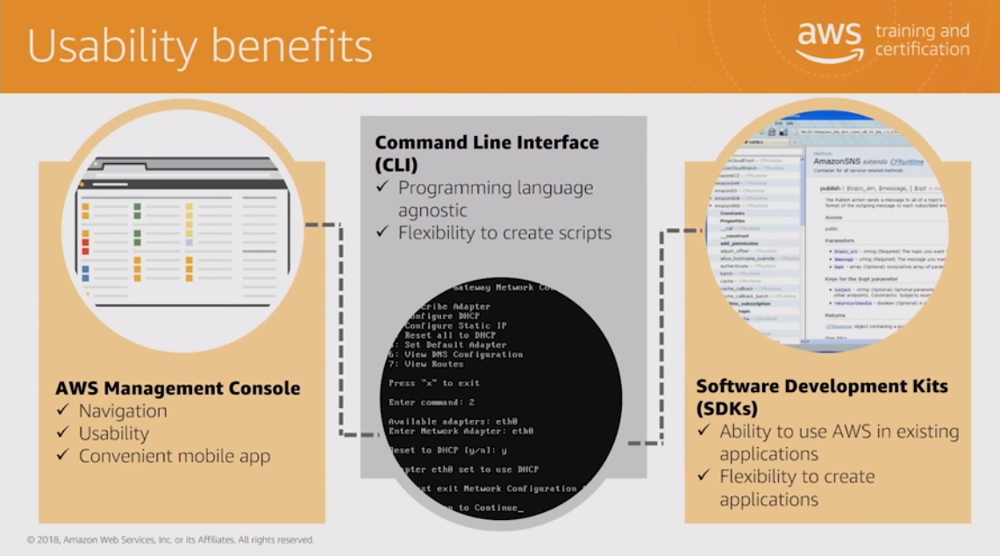

# AWS Cloud Practitioner Essentials (Second Edition)

## Introduction

* AWS 

    * Regios 
        * AWS servers located all over the globe
        * Each region is a separete geographic area that has multiple isolated locations **known as availability zones**

    * Availability zones
        * One of more discreet datacenters
        * Contains redundant power, network, and connectivity
        * House in separete facilities 

    * Fault-tolerant: System remains available in case part of it fails (CAP theorem)
        * Redundancy 
    

    * Security

        * The customer decides the region systems will be deployed
        * Ownership of data
        * How do you handle encryption and encryption keys

    * Three ways to use AWS
        * AWS Cli 
        * AWS Management Console (browser)
        * Software Developer Kits (SDKs)

        * 

        * Each user (IAM) can create Resource Groups
            * A resource group is a group of AWS services (dashboard)
        
        * You can also tag resources in order to do a quick search later (tag is key/value)