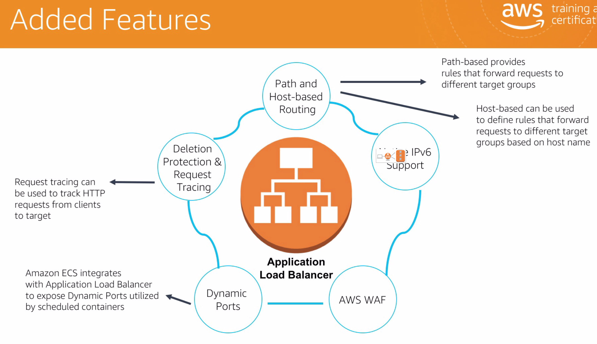

# AWS Cloud Practitioner Essentials (Second Edition)

## Cloud

* Cloud computing
    * On deamand computing

* Regios 
    * AWS servers located all over the globe
    * Each region is a separete geographic area that has multiple isolated locations **known as availability zones**

* Availability zones
    * One or more discreet datacenters
    * Contains redundant power, network, and connectivity
    * House in separete facilities 

* Fault-tolerant: System remains available in case part of it fails (CAP theorem)
    * Redundancy 

* Security

    * The customer decides the region systems will be deployed
    * Ownership of data
    * How do you handle encryption and encryption keys
    * State of the art eletronic suverllaince, and multi factor access control system
    * Staffed with 24/7 secutiry guards and access is extremely regulated 
    * Multiple availability zones covers natural disasters and system failure 

## Interface

* Three ways to use AWS
    * AWS CLI
    * AWS Management Console (browser)
    * Software Developer Kits (SDKs)

    * 

    * Each user (IAM) can create Resource Groups
        * A resource group is a group of AWS services (dashboard)
    
    * You can also tag resources in order to do a quick search later (tag is key/value)

# Core Services

* Elastic Cloud Compute (EC2)

    * Instances
        * Pay as you go
        * Broad selection of hardware and software 
        * Global hosting (many regions)
    

    * Setup
        * Login to AWS Console
        * Choose a region
        * Launch EC2 Wizard
        * Select AMI
            * Amazon Machine Image (Software)
        * Instance type (Hardware)
        * Configure network
        * Configure storage
        * Configure key pairs 
        * Launch and connect

* EBS (Elastic Block Store)

    * Storage unit for EC2 instance
    * Choose HDD or SSD
    * Persistent and customizable block storage for EC2 instances
    * Replicated in the same Availability Zone

    * Backup using snapshots
        * Share snapshots or even copy snapshots to a different AWS region (Virginia to Tokyo)

    * Easy and transparent Encryption
        * Encrypt data between EC2 instance and EBS inside Amazon networks without extra cost
    * Elastic volumes

    * Availability
        * Data in a volume is automatically replicated in multiple server at the availability zone
    
    * You can do resize operations on the fly (from 60gb to 100gb, from hdd to ssd)
        * No need to stop the instances
    
    * EC2 Instance must resign in the same availability zone and region as EBS instance for the connection to be made

    * `lsblk`: List block devices (hard drives)
        * `lsblk` lists information about all available or the specified block
       devices.  The lsblk command reads the sysfs filesystem and udev db to
       gather information. If the udev db is not available or lsblk is
       compiled without udev support than it tries to read LABELs, UUIDs and
       filesystem types from the block device. In this case root permissions
       are necessary.
    
    * `mke2fs /dev/xvdb`: `xvdb` in this case is the new block device attached to the EC2 instance 
        * Will create a file system on this volume
        * `mount /dev/xvdb /mnt`: Mounting file system inside `/mnt`
            * `unmount /mnt`: Now I can detach the volume from my instance 
    
    * You can drill down your bill per tags
        * Tags are relevant

* Amazon Simple Storage Service (S3)

    * Managed cloud storage service 
    * Store virtually unlimited number of objects
    * Access any time, any where
        * http, and https
    * Rich security controls
        * None of your data is shared publicly by default 

    * The data stored inside a bucket can be configure to be replicated at many other regios (cross region replication)

    * Common Use Cases
        * Storing application assets
            * media files
            * logs
            * images
        * Static Web Hosting 
        * Backup and disaster recovery
            * Supports cross region replication
        * Staging area for Big data
            * Amazon Redshift 
        * Many more...
    
    * Bucket name must be DNS compliant 
    * AWS CLI

        * `aws s3 cp demo.txt s3://amazing-bucket-1/hello.txt`
        * `aws s3 sync some-folder s3://amazing-bucket-1/files`
            * Sync an entire folder with s3
        
        * Inside an EC2 instance

            * Remember to have the correct IAM access / policy to access the bucket 

            * `aws s3 ls s3://amazing-bucket-1 --recursive`
                * List all files (even inside directories) inside bucket `amazing-bucket-1`
            
            * `aws s3 cp s3://amazing-bucket-1/hello.txt .`
                * Copy txt file from bucket to desktop
                * You could also do the `sync` command in reverse
        

* AWS Global Infrastructure

    * Regions
        * Geographic areas that hosts two or more Availability zones
        * Resources in one regions are not automatically copied to other regions 
        * **Not all services are available at all regions**
    * Availability zones
        * Availability zones are phisically distinct, separate from one to another, but they are connected by a low latency network
        * The get support from different energy source providers and internet providers (tier-1)
        * If one zone goes down, the other ones can handle requests (fault-tolerant)
    * Edge locations
        * CDN - Clound Front
            * Content Delivery Network
        * Request for content is automatically routed to the nearest edge location, so the content is delivered faster to the end users.

* Amazon Virtual Private Cloud (VPC)

    * A private, virtual network in the AWS Cloud
        * Uses same concepts as on premise networking

    * Allows complete control of network configuration
        * Ability to isolate and expouse resources inside VPC
            * Control IP address spaces 
            * Subnets
            * Routing tables

    * Offers several layers of security controls
        * Ability to allow and deny specific internet and internal traffic 
        * Routing tables 
    * Other AWS services deploy into VPC
        * Services inherent security built into network

    * VPC is a foundational AWS service and integrate with numerous other services

    * 

    * Amazon Elastic Computer instances (EC2) are deployed in your Amazon VPC
    * Same for Amazon Relational Database Service (RDS)
    
    * Features

        * VPC defines a IP address space (divided by subnets)

        * Builds upon high availiability of AWS Regions and Availability Zones (AZ)
            * Amazon VPC lives within a Region
            * Multiple VPCs per account
        
        * Subnets
            * Used to divide Amazon VPC
            * Allows Amazon VPC to span multiple Availabilty Zones (Azs)

            *  
        
        * Route tables
            * Control traffic between the subnets and the internet 
            * By default, all subnets within a VPC can communicate with each other
            * Control traffic going out of the subnets
        
        * Public and private subnets
            * Public has access to the internet
            * Private has no access to the internet 

        * Internet Gateway (IGW)
            * To a subnet to be public, we need to attache a internet gateway to the VPC and update the route table of the subnet to send non local traffic to the internet gateway
            * They also need a public ip address to route to an internet gateway
            * Allows access to Internet from Amazon VPC
        
        * NAT Gateway
            * Allows private subnet resources to access Internet 
        
        * Network Access Control Lists (NACL)
            * Control access to subnets; stateless  

        *  

* AWS Security Groups

    * Act as built-in firewalls
    * Control accessibility to instances 

    * Built-in firewall for your virtual services

    * Full control your instance are
        * Another method to filter traffic to your instances
        * Determine how has access to your instance
            * You would determin a security group role

        *  
    
    * `http` is port `80` and `https` is port `443`
        * To access traffic from anywhere from the internet we may use `0.0.0.0/0`
    
    *  

# Integrated Services

* Elastic Load Balancer services
    * Application Load Balancer
        * Offers all features from Classic Load Balancer plus more
            * Additional Supported Protocols
            * Cloud Watch Metrics
            * Access Logs
            * Health Checks
        *  
    * Classic Load Balancer

    *  
        * Use containers to host your micro services and route to those applications from a single load balancer
        * Application Load Balancer allows you to route different requests to the same instance, but differ the path based on the port.
        * If you have different ports, you can setup routing rules to distribute traffic traffic to only one desired backend application.

    
    * Target groups
        * Because the Application Load Balancer register targets instead of instances, a **target group** is how a target is registered to the load balancer
            * One instance running many container apps 
        * When configuring the **listners** for the load balancer, you create **rules** in order to direct how requests received by the load balancer will be routed to the backend target.
    

    * Listners
        * A listner is a a process that checks for connection requests, using the protocol and port that you configured. The rules that you define for a listner determine how the load balancer routes requests to the target in one or more target groups.

    * Target Group
        * Each target group routes requests to one or more registered targets using protocols and port number specified. A target can be registered with multiple target groups. Health checks can be configured on a per target group basis

    * Target
        * A target is a destination for traffic based on the established listner rules.

    * Listners -> Target Group -> Target 

    *  

    *   

    *  

    * 

        * You can see the listners for por `80` and `443`
            * Two containers running inside an EC2 instance

        * We must select at least 2 availability zones where the service is available (two ec2 instances, one at each zone)
            * Inside the same VPC (can be subnets)

* Auto Scaling 

    * Launch Configuration
        * What to deploy
    
    * Auto Scaling Group
        * Where to deploy
    
    * Auto Scaling Policy
        * When to deploy

* Route 53

    * DNS (Domain Name Service)

    * Create Hosted Zone
        * Main Domain
        * Add subdomains 

* Amazon RDS

    * When selecting subnet you are choosing the availability zone it will be deployed 

    * It replicates the db in another availability zone 

* AWD Lambda

    * 6mb limit
    * 5 min limit 
    * AWS S3 + CloudWatch + Lambda
    * Kineses + Lambda
    * Dynamo DB + Lambda